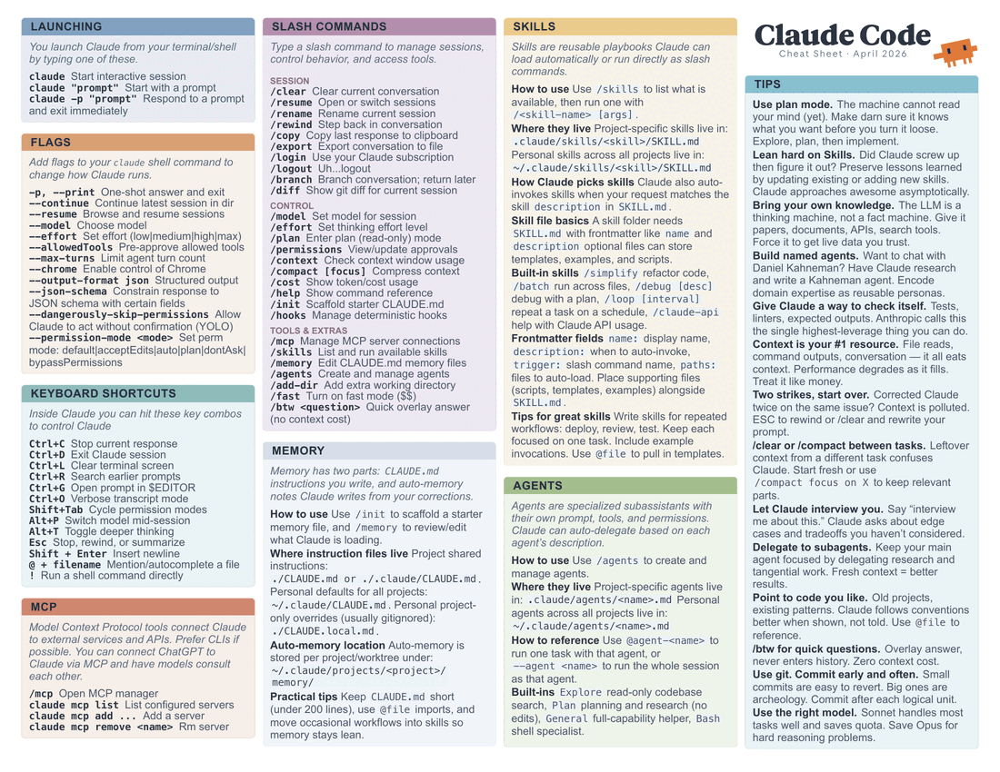

# AI Harness Cheatsheets

Dense, printable, single-page cheatsheets for AI coding tools. Built with [Typst](https://typst.app/).



## Cheatsheets

| Tool | Source | PDF |
|------|--------|-----|
| Claude Code | `claude-code/cheatsheet.typ` | [⬇ Download latest](https://github.com/kljensen/ai-harness-cheatsheets/releases/latest/download/claude-code.pdf) |

## Quick Start

```bash
# Build the default (paper_garden theme)
just claude

# Preview as PNG
just preview

# Build all 23 theme variants + combined PDF
just variants
```

## Themes

All themes render on white paper with colored section headers and subtle card tints. Pass `--input theme=<name>` to select one, or run `just variants` to render all into `claude-code/variants/ALL-THEMES.pdf`.

| Theme | Style |
|-------|-------|
| `classic` | Saturated Tailwind 600 headers, white text, subtle tints |
| `open_sorbet` | Open Color pastel accents |
| `radix_gentle` | Radix UI light scale |
| `pastel_blossom` | Warm pastel accents |
| `mint_latte` | Cool green-tinted pastels |
| `nord_soft` | Nord arctic palette, soft tints |
| `catppuccin_latte_soft` | Catppuccin Latte flavor |
| `lavender_mist` | Lavender-leaning pastels |
| `paper_garden` | Warm earthy pastels (current default) |
| `sunrise_chalk` | Warm chalky pastels |
| `dusty_ocean` | Desaturated cool-blue pastels |
| `tailwind_pro` | Saturated Tailwind 600 headers, uniform neutral bodies |
| `slate_wash` | Saturated headers, subtle warm-gray tint variation |
| `ink_wash` | Desaturated earthy accents (steel, sage, terracotta) |
| `blueprint` | Deep Tailwind 700 headers, clean white bodies |
| `anthropic` | Warm earth tones, linen feel |
| `nord_functional` | Extended Nord with 12 distinct hues |
| `warm_terra` | Muted warm earth tones, uniform linen tint |
| `ocean_deep` | Deep saturated ocean-inspired palette |
| `mono_slate` | Zinc neutrals with saturated accent headers |
| `colorbrewer_set3` | ColorBrewer 12-class qualitative palette |
| `github_primer` | GitHub Primer design system colors |
| `dracula_light` | Dracula adapted for light backgrounds |

## Project Structure

```
.
├── claude-code/          # Claude Code cheatsheet
│   ├── cheatsheet.typ    #   main source
│   ├── cheatsheet.pdf    #   compiled output
│   └── variants/         #   all theme variants + ALL-THEMES.pdf
├── lib/
│   └── cheatsheet.typ    # shared template library (themes, components)
├── assets/
│   ├── clawd-mini.svg    # Claude mascot (Clawd)
│   └── fonts/            # Anthropic Sans & Serif
├── scripts/
│   └── render-theme-variants.sh
├── research/             # design research & spikes
└── issues/               # issue tracking docs
```

## Requirements

- [Typst](https://typst.app/) (tested with v0.13+)
- [just](https://github.com/casey/just) (command runner)
- [Ghostscript](https://www.ghostscript.com/) (`gs`) — only needed for combining variant PDFs

## Contributing

PRs and issues are very welcome! Whether it's a new theme, a content fix, or a cheatsheet for another tool — open an issue or send a pull request.

## License

[Unlicense](LICENSE) — public domain. Do whatever you want with it.
